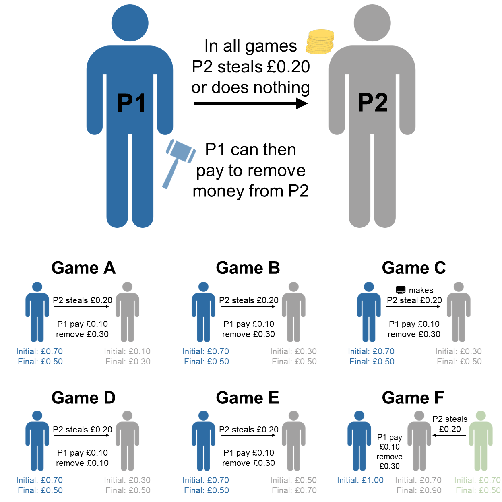

```{r options, echo=FALSE}
opts_chunk$set(echo = FALSE)
```

\linenumbers

# Introduction

Humans cooperate on a scale that is unparalleled in the animal kingdom. One 
mechanism thought to sustain this level of cooperation is costly punishment, 
whereby individuals harm others at a personal cost[@CluttonBrock1995], 
ostensibly encouraging cooperative behaviour from the target (or bystanders [@DosSantos2011;@DosSantos2013;@Raihani2015]) in the future. Punishment 
therefore offers a route to maintaining or increasing cooperation by changing 
the payoff structure of social interactions such that it no longer pays to cheat 
or exploit social partners[@CluttonBrock1995;@Ostrom1990].

In humans, many studies of punishment have been carried out in laboratory 
settings using economic games[@Balliet2011;@Balliet2013;@Chaudhuri2011;
@Dreber2008;@Fehr2000;@Fehr2002;@Henrich2006;@Nikiforakis2008a;@Raihani2012a;
@Raihani2019]. In these games, participants are usually given a sum of money 
that they can use to invest in collective action or to help others. 
Alternatively, participants can 'cheat' by keeping the money for themselves or 
by exploiting the contributions of others. Punishment is introduced into such 
games by giving participants the option to pay a small 'fee' to impose a greater 
'fine' on their co-players. Several lines of experimental evidence indicate that 
people use this punishment option[@Henrich2006], that they enjoy 
punishing[@DeQuervain2004], and that they frequently, though not 
always[@Herrmann2008], punish cheating or exploitative 
co-players[@Fehr2000;@Fehr2002].

Evidence from these experiments suggests that the threat of costly punishment 
plays an important role in promoting human cooperation. People tend to cooperate 
more in games where punishment is possible compared to those where it is not
[@Balliet2011;@Balliet2013;@Raihani2019]. The effect that the threat of 
punishment has on cooperation is also evident in the higher contributions 
typically observed in the Ultimatum Game (where punishment is possible) compared 
to the structurally-similar Dictator Game (where it is not)[@Camerer2003]. This 
typical cooperation-enhancing effect of punishment has also been observed across 
societies[@Balliet2013], leading some to suggest that costly punishment has 
played a key role in the cultural evolution of cooperation in humans
[@Bowles2013;@Boyd2003;@Chudek2011;@Henrich2017].

Nevertheless, it remains unclear whether individuals playing economic games use
punishment as a behaviour-change tool to enforce cooperation or as a means to 
achieve other ends. Some have argued that punishment is primarily used to shape 
future behaviour, either to deter personal harm[@Delton2017;@Dreber2008;
@DosSantos2013] or to uphold normative standards of cooperative behaviour 
[@Boyd2003;@Chudek2011;@Fehr2018;@Mathew2011;@Mathew2014;@Richerson2016]. 
But while the _threat_ of punishment can have a cooperation-enhancing effect, 
the _enactment_ of this punishment does not consistently deter targets from 
cheating in the future[@Raihani2019]. This calls into question whether 
punishment primarily operates as a behaviour-change tool or whether it is used 
to achieve other goals.

Beyond behaviour-shaping concerns, there are a host of other reasons why people 
may want to punish in economic games. Punishers might be motivated by a desire 
for retribution rather than deterrence, punishing in proportion to the amount 
of harm that was personally caused[@Carlsmith2002]. Punishment might be driven 
by concerns about relative payoffs, such as disadvantageous inequity aversion 
(i.e., avoiding having less than others[@Raihani2012b;@Raihani2019]) and/or 
general egalitarian preferences (i.e., wanting all participants to receive the 
same payoffs[@Dawes2007]). Such concerns about relative payoffs may be activated 
when participants earn less than cheats in economic games or when there are 
income disparities in these settings. People might also use punishment for 
competitive purposes, seeking advantageous inequity for themselves (i.e., having 
more than others) and/or improving their relative position[@Raihani2019].

Common economic game designs have been unable to tease apart these different 
motives for punishment because participants who interact with cheats in these 
games experience both losses _and_ lower relative payoffs. The typical 1:3 
fee-fine ratio of punishment in economic games compounds this issue. With 
this setup, people can simultaneously use punishment to reciprocate losses, to 
deter others from cheating, and to reduce or reverse disparities in payoffs 
between themselves and targets. To add to this complexity, it is evident that 
people use punishment in seemingly disparate ways: punishing when no behaviour 
change is possible, such as in one-shot games[@Bone2015;@Henrich2006;
@Raihani2012b;@Walker2004], on the very last round of repeated games
[@Barclay2016], or in games where the target never learns about the 
punishment[@Crockett2014]; punishing those who did not cheat or who 
over-contributed to collective action (antisocial punishment
[@Herrmann2008;@Sylwester2013]); punishing in scenarios where they were not 
personally harmed (third-party punishment[@Fehr2004]); and punishing in 
scenarios where disparities in payoffs did not arise from participants' 
actions[@Dawes2007;@Johnson2009;@Fowler2005].

The general conclusion from this research is that there is no one unifying 
function of costly punishment in humans. Instead, punishment should be thought 
of as a flexible behavioural tool that serves a variety of functions that are 
not mutually exclusive[@Raihani2019]. Due to its multipurpose nature, we should 
therefore expect variation in punishment strategies in the population, much like 
the observed variation in social learning strategies[@Molleman2014]. Some 
individuals may use punishment as a behaviour shaping tool, for example, while 
others may use it to reduce or reverse payoff differentials.

This insight raises several underexplored questions. First, which punishment 
strategies are more frequent in human populations? Second, what traits predict 
adherence to a particular strategy? Previous work has reported that personality 
is related to cooperative behaviour[@Thielmann2020] and demographics, political 
ideology, and religiosity are related to punitive behaviour[@Hofmann2018], but 
no research has related these variables to specific punishment strategies. 
Third, do people have insight into their own punishment strategy? Previous work 
has argued that people are often unaware of the underlying function of their 
punitive behaviour, yet they feel compelled to enact it anyway
[@Carlsmith2002;@Nisbett1977].

Here, we aim to delineate nine possible punishment strategies by asking 
whether people punish in a manner consistent with a specific strategy and, if 
so, what other characteristics (personality, social preferences, political 
orientation) predict the use of different punishment strategies. Table 
\@ref(tab:tableStrategies) summarises the potential functions for costly 
punishment in the economic games that we considered, and the behavioural 
strategies they predict. Note that Table \@ref(tab:tableStrategies) is not 
an exhaustive list of all possible punishment strategies: we do not include 
reputational functions of punishment in this table, such as signalling 
trustworthiness[@Barclay2006;@Batistoni2022;@Jordan2016;@Jordan2017;@Raihani2015], 
because our focus is on punishment strategies in anonymous economic games without 
reputational incentives (but see ref[@Jordan2020]).

Building on previous designs[@Bone2015;@Deutchman2021;@Marczyk2017;
@Raihani2012b], we employ a suite of one-shot economic games where individuals 
are given the opportunity to punish targets at a personal cost (Figure 
\@ref(fig:plotGames)). In each game, targets either steal from another 
individual or do nothing. Representative samples of participants from the United 
Kingdom (*n* = `r sum(tar_read(dExc)$Country == "United Kingdom")`) and the 
United States (*n* = `r sum(tar_read(dExc)$Country == "United States")`) 
completed all six games on the online platform Prolific. We carefully designed 
the suite of games to tease apart the proposed punishment strategies in Table 
\@ref(tab:tableStrategies), such that each strategy predicts a different pattern 
of behaviour across all the games (see Methods for more detail about the six 
games). We use the resulting behavioural patterns to discern which punishment 
strategy participants are employing. We then combine these behavioural patterns 
with data on demographics, personality, social preferences, political ideology,
religiosity, and self-reported strategy usage.

(ref:plotGamesCaption) *Visual summary of the six economic games.* In all
games, Player 2 either steals £0.20 from Player 1 (the focal player) or does 
nothing. Player 1 is then given the option to punish by paying a certain amount 
of money to remove money from Player 2 (this money is destroyed). The six games
are variants on this general setup, creating situations where (A) Player 2 is
still worse off by stealing, (B) Player 2 creates equality by stealing, (C) the
computer "decides" whether Player 2 steals, (D) the fee-fine ratio is 1:1, (E)
Player 2 is better off by stealing, and (F) Player 2 steals instead from a 
third-party.

```{r plotGames, out.width="100%", fig.cap="(ref:plotGamesCaption)"}

```

(ref:tableStrategiesCaption) \scriptsize Summary of the different functions for 
punishment and the behavioural strategies they predict. *Games A-F are 
the games employed in the current study (see Methods for more details). In each 
of the six games, participants are given the opportunity to punish players who 
"steal" and those who do not, meaning that participants make twelve punishment 
decisions in total. Each behavioural strategy implies a unique pattern of 
punishment across all decisions. Green ticks reflect decisions to punish, red 
crosses reflect decisions to not punish. In column headers, payoffs at the first 
stage (above) and the second stage (below) are denoted as P1-P2 (or P2-P3 [P1] 
for Game F) where participants take the role of P1 and P2 is the target of 
punishment. AI = advantageous inequity, DI = disadvantageous inequity.*

```{r tableStrategies}
apa_table(
  tar_read(tableStrategies),
  escape = FALSE,
  landscape = TRUE,
  align = c("p{1.7cm}", "p{3.3cm}", rep("c", 12)),
  col_spanners = list(
    "\\thead{\\scriptsize Game A \\\\ (AI) \\\\ 70-10}"   = 3:4,
    "\\thead{\\scriptsize Game B \\\\ (Equal) \\\\ 70-30}"   = 5:6,
    "\\thead{\\scriptsize Game C \\\\ (Computer) \\\\ 70-30}"   = 7:8,
    "\\thead{\\scriptsize Game D \\\\ (1:1 Fee-Fine) \\\\ 70-30}"   = 9:10,
    "\\thead{\\scriptsize Game E \\\\ (DI) \\\\ 70-50}"        = 11:12,
    "\\thead{\\scriptsize Game F \\\\ (Third-Party) \\\\ 70-70 [100]}" = 13:14
    ),
  caption = "(ref:tableStrategiesCaption)",
  font_size = "scriptsize"
)
```

# Results

```{r MLMs}
mlm1 <- coef(summary(tar_read(mlm1)))
mlm2 <- coef(summary(tar_read(mlm2)))
```

The overall pattern of punitive behaviour in the six economic games was in line 
with previous research and very similar across both countries (Figure 
\@ref(fig:plotDecisions)). Participants were generally more likely to punish 
targets who stole from another individual compared to targets who did not steal 
(multilevel logistic regression; _b_ = 
`r printnum(mlm1["otherTook","Estimate"])`, standard error = 
`r printnum(mlm1["otherTook","Std. Error"])`, _p_ 
`r printp(mlm1["otherTook","Pr(>|z|)"])`). Participants were also more likely 
to punish when targets' stealing behaviour generated inequalities, 
specifically in Games E and F (_b_ = 
`r printnum(mlm2["DI","Estimate"])`, SE = `r printnum(mlm2["DI","Std. Error"])`, 
_p_ `r printp(mlm2["DI","Pr(>|z|)"])`).

(ref:plotDecisionsCaption) *Overall pattern of punitive behaviour across all six 
economic games, split by country.* AI = advantageous inequity, DI = 
disadvantageous inequity.

```{r plotDecisions, fig.width=8, fig.height=5, fig.cap="(ref:plotDecisionsCaption)"}
tar_read(plotDecisions)
```

We classified participants into a particular strategy if their behaviour across 
all twelve decisions matched our behavioural predictions shown in Table 
\@ref(tab:tableStrategies) exactly. Table \@ref(tab:tableStrategyCounts) shows 
the proportion of participants following each strategy, with N/A used to 
represent participants who did not fit exactly into any particular strategy type.
Overall, `r printnum(mean(tar_read(dExc)$strategy != "N/A")*100, digits = 0)`%
of our participants could be classified exactly into one of the strategies. The
most common strategy in both countries was to never punish across any of the
games. The next most common strategies were those that care about
minimising payoff differences (avoid disadvantageous inequity, egalitarian). 
Less common were the behaviour-shaping strategies (deterrent, norm-enforcing),
the retributive strategy, and the competitive strategies (seek AI, competitive). 
Although participants often punished targets who did not steal 
in the six games (Figure \@ref(fig:plotDecisions)), no participants followed the 
antisocial strategy by exclusively punishing targets who did not steal across 
_all_ games.

(ref:tableStrategyCountsCaption) Counts and proportions of participants 
following each punishment strategy exactly, split by country. N/A implies that
participants were unable to be classified exactly into any of the punishment
strategies.

```{r tableStrategyCounts}
apa_table(
  tar_read(tableStrategyCounts),
  escape = FALSE,
  align = c("l", rep("c", 4)),
  col_spanners = list(
    "\\thead{United Kingdom \\\\ (N = 1014)}" = 2:3,
    "\\thead{United States \\\\ (N = 996)}" = 4:5
    ),
  caption = "(ref:tableStrategyCountsCaption)"
)
```

To further investigate the strategies that participants were following, we 
examined the most common patterns of punitive behaviour across all twelve 
decisions. Supplementary Table \@ref(tab:tablePatterns) shows the proportion of 
participants following the 25 most common behavioural patterns, including, 
where appropriate, the predetermined strategies from Table 
\@ref(tab:tableStrategies). In both countries, a common pattern of behaviour 
not captured by any of the strategies was punishing only when the target stole
in the third-party game (Game F). Punishment in this game is consistent with an 
egalitarian motive, as stealing produces unequal outcomes, but third-party 
punishment here is also consistent with norm-enforcing and competitive motives 
(see Table \@ref(tab:tableStrategies)). Other common behavioural patterns not 
captured by our strategies included punishing whenever the target stole across 
all games and always punishing in every game irrespective of the targets' 
behaviour.

While it is useful to look at exact patterns of behaviour, participants may not 
have implemented their chosen punishment strategy with exact precision.
In reality, strategies may have been implemented probabilistically for each 
punishment decision. There is also the possibility of implementation errors, 
whereby participants occasionally "slip up" and make decisions that are 
incongruent with a particular strategy. This may explain why some participants 
were unable to be classified exactly into a single punishment strategy.

To deal with this complexity and include all observed data in our frequency 
estimates, we fitted a Bayesian latent state model to the data. This model 
assumes that the nine strategies in Table \@ref(tab:tableStrategies) (plus a 
"random choice" strategy that chooses randomly for each decision) are the only 
latent strategies and that these are instantiated into observed behaviour 
according to the logic in Table \@ref(tab:tableStrategies) with some 
probability of implementation error (i.e., an intention to punish is implemented 
as non-punishment and vice versa). Averaging over all strategies and 
incorporating the possibility of implementation errors, the model estimates the 
probability of participants following any particular strategy, given the 
observed data.

The posterior estimates from the model are presented in Figure 
\@ref(fig:plotModel1b). The posterior probabilities for each strategy did not
differ between the two countries. In both countries, the never punish strategy
had the highest probability, followed by the egalitarian strategy. The
norm-enforcing and seek AI strategies were the next most likely, with higher
posterior estimates than the competitive and antisocial strategies. None of the
other strategies differed in their posterior estimates. The same general pattern
emerged when we analysed the full dataset without pre-registered exclusions 
(Supplementary Figure \@ref(fig:plotModel1a)).

(ref:plotModel1bCaption) *Posterior estimates of the probabilities of following
different punishment strategies from the Bayesian latent state model.* The model 
assumes an implementation error rate of 5%. Points represent posterior medians, 
line ranges represent 50% and 95% credible intervals.

```{r plotModel1b, fig.width=7, fig.height=5, fig.cap="(ref:plotModel1bCaption)", warning=FALSE}
tar_read(plot1.2)
```

Next, we explored which traits predicted adherence to different punishment 
strategies. To answer this question, we included variables capturing 
demographics, personality, social preferences, political views, and religious 
views as predictors in our Bayesian latent state model. We included each 
variable in a separate model, predicting all ten punishment strategies 
(the nine from Table 1, plus the 'random choice' strategy) simultaneously.

```{r sesSlope}
ses <- tar_read(post2.2_SES)$beta[,2,10]
```

Demographic variables tended to be unrelated to strategy usage: age and gender
did not predict adherence to a particular punishment strategy (Supplementary 
Figures \@ref(fig:plotAllDems2) and \@ref(fig:plotAllDems1)). In the United 
States, the never punish strategy was slightly more common among participants 
lower in socio-economic status (median posterior slope = 
`r printnum(median(ses))`, 95% CI [`r printnum(quantile(ses, 0.025))` 
`r printnum(quantile(ses, 0.975))`]) but this effect was small.

Conversely, personality and social preferences were linked to variation in 
punishment strategies. When including the Big-6 personality dimensions and 
Social Value Orientation (SVO) in the model, we found associations with the 
egalitarian, never punish, and random choice strategies (Figure
\@ref(fig:plotAllPers2)). Participants higher in SVO were more likely to follow 
the egalitarian and the never punish strategies, while those with lower SVO 
scores were more likely to enact the random choice strategy. The personality 
dimensions of honesty-humility and openness to experience were both positively 
associated with following the never punish strategy, while extraversion 
negatively predicted this strategy. The effects were mostly similar across
countries, but occasionally differed: for example, in the United States,
but not in the United Kingdom, honesty-humility was positively associated with 
following the egalitarian strategy and negatively associated with following 
the random choice strategy. Overall, the same pattern of results emerged when 
analysing the full dataset without exclusions (Supplementary Figure 
\@ref(fig:plotAllPers1)).

(ref:plotAllPers2Caption) *Posterior slopes from Bayesian latent state models 
including Big-6 personality dimensions and Social Value Orientation.* Each row 
represents a separate model. All models assume an implementation error rate of 
5%. Points represent posterior medians, line ranges represent 95% credible 
intervals.

```{r plotAllPers2, fig.width=7.5, fig.height=3.5, fig.cap="(ref:plotAllPers2Caption)", warning=FALSE}
tar_read(plotAllPers2)
```

Political and religious variables were also associated with punishment strategy 
(Figure \@ref(fig:plotAllPolRel2)). These effects tended to be more pronounced 
in the United States. Controlling for Social Dominance Orientation, American 
participants higher in Right Wing Authoritarianism were more likely to follow 
the strategies avoiding disadvantageous inequity and seeking advantageous 
inequity. Participants who stated that they would like to "bring those below 
them [on the socio-economic status ladder] up a peg" were more likely to follow 
the egalitarian strategy, while American participants higher in Social Dominance 
Orientation, Right Wing Authoritarianism, and believing that God controls events 
in the world were less likely to follow the egalitarian strategy. In general, 
religious and conservative participants were less likely to follow the never 
punish strategy. This general pattern of results was replicated with the full 
dataset (Supplementary Figure \@ref(fig:plotAllPolRel1)).

(ref:plotAllPolRel2Caption) *Posterior slopes from Bayesian latent state models 
including political ideology, views about social inequality, and religiosity.* 
Each row represents a separate model aside from Social Dominance Orientation and 
Right Wing Authoritarianism, which control for one another within the same 
model. All models assume an implementation error rate of 5%. Points represent 
posterior medians, line ranges represent 95% credible intervals.

```{r plotAllPolRel2, fig.width=7.5, fig.height=3.5, fig.cap="(ref:plotAllPolRel2Caption)", warning=FALSE}
tar_read(plotAllPolRel2)
```

Finally, we asked whether participants had insight into their own punishment 
strategy. In other words, could participants self-report the strategy that they 
were following during the games? To answer this question, we included 
participants' responses to post-game questions about their strategy as 
predictors in the model. As before, each predictor was included in a separate 
model, predicting all ten strategies simultaneously.

In general, we found that self-reported strategy usage was positively associated
with the behavioural strategy that participants employed (see Supplementary 
Figures \@ref(fig:plotSliders1) and \@ref(fig:plotSliders2) for the distribution 
of responses to self-report questions). Figure \@ref(fig:plotAllSliders2) shows 
the relationships between self-report questions and the different punishment 
strategies, highlighting the combinations where the question matched the 
behavioural strategy. We found positive relationships between the self-report 
questions and strategy usage for the norm-enforcing, egalitarian, seek 
advantageous inequity, never punish, and random choice  strategies. The 95% 
credible intervals for other estimates included zero, though these estimates 
often trended in a positive direction. The same pattern of results was found 
when analysing the full dataset without exclusions  (Supplementary Figure 
\@ref(fig:plotAllSliders1)).

(ref:plotAllSliders2Caption) *Posterior slopes from models including 
self-reported strategy usage.* Each row represents a separate model. All models 
assume an implementation error rate of 5%. Highlighted estimates represent 
combinations where the self-report question matched the behavioural strategy. 
Points represent posterior medians, line ranges represent 95% credible 
intervals.

```{r plotAllSliders2, fig.width=7.5, fig.height=4, fig.cap="(ref:plotAllSliders2Caption)", warning=FALSE}
tar_read(plotAllSliders2)
```

# Discussion

Using a suite of economic games measuring punishment in different situations, 
we have shown that punishment does not serve just one function, but instead is 
a flexible tool that can be and is used for different purposes[@Raihani2019]. 
Punishment is more akin to a swiss army knife than a hammer, used by some to 
enforce norms of cooperation and by others to reduce or even create inequality 
between individuals. We found that people's punishment strategy can, to some 
extent, be predicted by individual differences in personality, social 
preferences, and political and religious views. Moreover, contrary to the view 
that people are often unable to articulate the reasons for their punitive 
behaviour[@Carlsmith2002], people seem to have some degree of insight into the 
strategy they are using. Despite small differences, these general patterns 
replicated in samples from both the United Kingdom and the United States.

Among the punitive strategies, the most common were particularly sensitive to 
inequality in payoffs, either from a self-referential perspective (i.e., avoid 
disadvantageous inequity) or more generally (i.e., egalitarian). This is in 
line with previous studies which have highlighted inequity aversion as an 
important motivation for punishment in economic games 
[@Dawes2007;@Raihani2012b]. Personality and social preference variables mapped 
onto these strategies in expected ways. Traits associated with other-regarding 
concern, such as SVO and honesty-humility, predicted following the egalitarian 
strategy, whereas religious and conservative individuals were less likely to 
follow this strategy, especially in the United States. Moreover, participants 
following the egalitarian strategy were able to self-report this strategy, 
though the same was not true for the avoid disadvantageous inequity strategy.

Behaviour shaping strategies, such as deterrence and norm-enforcement, were less 
common than strategies sensitive to inequality in our set of games. This was 
reflected both in participants’ elicited punishment behaviour (Figure 
\@ref(fig:plotModel1b)) and in their self-reports of their own strategy 
(Supplementary Figures \@ref(fig:plotSliders1) and \@ref(fig:plotSliders2)). 
Regarding the predictors of these strategies, we found that demographic, 
personality, political, and religious variables tended to be unrelated to 
deterrent and norm-enforcing punishment strategies. We also found that 
participants had insight into the norm-enforcing strategy, but not the deterrent 
strategy. This finding is in line with previous research showing that people 
struggle to accurately report the deterrent motivations for their punitive 
behaviour[@Carlsmith2002].

Other punitive strategies were less common in our dataset, but some were more 
prevalent than others. For example, participants were more likely to use 
punishment to seek advantageous inequity than to exclusively harm those who did 
not steal (i.e., antisocial punishment). The existence of the "seek AI" strategy 
in our dataset supports the claim that punishment can also be used as a tool to 
increase one’s own relative position[@Raihani2019]. While generally rare, we 
found that this motive for punishment was more common among authoritarian 
participants, at least in the United States, potentially providing an 
explanation for why peer punishment has been found to be more common among 
conservatives in previous work[@Hofmann2018]. Moreover, the fact that no 
participants in our sample punished non-stealing across all games suggests that 
antisocial punishment does not function to harm cooperators specifically, as has 
been previously suggested[@Herrmann2008]. Instead, antisocial punishment appears 
to be motivated by improving one's relative position in general, which is in 
line with work showing that antisocial punishment disappears with a 1:1 fee-fine 
ratio[@Sylwester2013].

The fact that people use punishment for many different reasons poses problems 
for the way that punishment is operationalised in classic behavioural economic 
game studies. In these studies, a common assumption is that participants will 
punish to change the behaviour of cheats. But in reality, people may be choosing 
the punishment option to achieve a variety of different goals. The targets of 
punishment in these studies are likely well aware that punishment could be 
levied for these different reasons and this knowledge may impact their 
responses. For example, if cheating targets interpret punishment as serving a 
competitive motive, it may elicit retaliation rather than encourage 
cooperation[@Dreber2008;@Nikiforakis2008b;@Raihani2019]. This might help to 
explain the mixed findings in the field as to whether punishment actually 
motivates cheating targets to cooperate in the future[@Raihani2019].

It is striking that the most common strategy in our dataset was to never punish. 
This is partly because punishment in these games imposes an economic cost for no 
tangible benefit. If the fee-fine ratio had been lower such that it was cheaper 
to punish, we may have seen more punishment from participants. Indeed, 
`r printnum(mean(tar_read(dExc)$SelfRate10[tar_read(dExc)$strategy == "Never punish"] > 0, na.rm = TRUE)*100, digits = 0)`% 
of participants following the never punish strategy positively stated that they 
didn't want to pay to reduce anyone's bonus but would have done so if it were 
free. But the frequency of the never punish strategy perhaps also reflects a 
more general aversion to peer punishment, an aversion that has been highlighted 
in both WEIRD (Western, educated, industrialised, rich, and democratic) samples
[@Balafoutas2014;@Balafoutas2016] and in small-scale societies[@Baumard2010]. 
One reason that people may be averse to peer punishment is that, due to its 
multipurpose nature, it may be interpreted as a competitive challenge by targets 
and trigger retaliation[@Raihani2019]. In situations that lack clear 
institutional norms to legitimise punishment, such as our economic games and 
some situations in the real world, people might abstain from peer punishment to 
avoid such retaliation, regardless of whether retaliation is actually possible. 
By contrast, institutionalised punishment in small-scale societies often 
functions to compensate victims adequately while limiting the potential for 
feuds and cycles of retaliation[@Fitouchi2023;@Singh2022]. Future research 
should uncover whether people are more willing to punish in these 
conventionalised contexts.

There are several limitations with our study design that can guide future 
research. First, we used one-shot economic games to measure punishment 
strategies, which may have led us to underestimate behaviour-change strategies 
like deterrence. Our inclusion of Game C somewhat mitigated this issue by 
manipulating whether stealing behaviour was intentional vs. unintentional and 
thus whether there was any behaviour to be deterred. Due to limits on our 
within-subjects design and the complexity of the strategy space, it was not 
feasible for us to expand our study to include additional contexts to elicit 
behaviour-change strategies (e.g., repeated games, games where targets are not 
made aware of the punishment, games where targets can retaliate). Future work 
could study these contexts separately.

A second limitation is that some strategies required more punishment than others 
to be met. For example, the competitive strategy required punishment in ten of 
twelve decisions, compared to the avoid disadvantageous inequity strategy which 
required only one instance of punishment (Table \@ref(tab:tableStrategies)). 
Strategies thus differed in how "expensive" they were to implement, perhaps 
explaining why some strategies were more common than others. This issue is 
largely unavoidable in our design since strategies, by their very nature, differ 
in how punitive they are. To partially mitigate this issue, we employed the 
strategy method to incentivise participants, such that payoffs were calculated 
from a randomly chosen game instead of summed across all games.

Another limitation is that our results may be contingent on the particular suite 
of anonymous stealing games that we used. With our anonymous design, we were 
unable to study other potential reputational strategies underlying punishment, 
such as signalling trustworthiness[@Jordan2020]. Moreover, stealing may be 
evaluated differently to other forms of cheating, such as not contributing to 
public goods, and other negative behaviours, such as lying or breaking taboos. 
Finally, we were unable to include all permutations of situational features in 
the games (e.g., second-party vs. third-party, equal vs. unequal) making it 
difficult to interpret some patterns of behaviour. For example, many 
participants punished only in the third-party game (Game F), but it is not clear 
whether these participants were driven by the third-party nature of the game or 
simply by the fact that stealing in that game generated inequality. Future work 
should determine whether different reputational contexts, target behaviours, and 
combinations of situational features elicit different punishment strategies.

In sum, we have shown that while many people choose not to punish peers, those 
who do are motivated by a variety of different concerns, including behaviour 
shaping, egalitarianism, and competition. Much like the observed variation in 
human social learning strategies[@Molleman2014], humans thus also exhibit 
variation in their punishment strategies. These individual differences map onto 
personality dimensions, social preferences, political and religious views, and 
self-reports of behaviour. We hope that future work will continue to unpack the 
multifaceted nature of human punishment.

# Methods

## Ethical approval

Ethical approval was granted by the University College London Ethics Board 
(project: 3720/002). The study was performed in accordance with all the relevant 
guidelines and regulations. Informed consent was obtained from all participants 
prior to the study.

## Pre-registration

We pre-registered the study on the Open Science Framework before collecting data 
in the United Kingdom (11^th^ November 2022; https://osf.io/k75fc). We submitted 
another pre-registration before collecting data in the United States (20^th^
June 2023; https://osf.io/q4hdy). In the pre-registrations, we outlined our 
study design, exclusion criteria, and analysis plan. As the study was 
exploratory, we did not pre-register any explicit hypotheses. We did not deviate 
from the pre-registrations.

## Exclusion criteria

We pre-registered that we would exclude participants who failed any of the 
attention checks, sped through the surveys (i.e., two standard deviations below 
the median duration), or flatlined (i.e., provided identical responses to matrix 
questions). We also stated that we would exclude data for particular games if 
participants failed the comprehension question for that game. We followed our 
pre-registered plan of conducting analyses with and without these exclusions 
(analyses without exclusions are reported in the Supplementary Material).

## Participants

```{r}
tar_load(c(d, dExc))
uk_n_full <- sum(d$Country == "United Kingdom")
uk_n_rtrn <- sum(d$Country == "United Kingdom" & !is.na(d$StartDate_Part2))
uk_n_excl <- sum(dExc$Country == "United Kingdom")
us_n_full <- sum(d$Country == "United States")
us_n_rtrn <- sum(d$Country == "United States" & !is.na(d$StartDate_Part2))
us_n_excl <- sum(dExc$Country == "United States")
```

We collected a representative sample of `r printnum(uk_n_full)` participants 
from the United Kingdom through the online platform Prolific 
(https://www.prolific.com/). All of these participants completed the economic 
games and `r printnum(uk_n_rtrn)` returned to complete the follow-up survey a 
week later (`r printnum((uk_n_rtrn / uk_n_full)*100, digits = 0)`% retention 
rate). After exclusions, we were left with `r printnum(uk_n_excl)` participants 
overall (see Supplementary Figure \@ref(fig:plotSampleUK) for sample 
characteristics).

We later collected a representative sample of `r printnum(us_n_full)` 
participants from the United States through Prolific. All of these participants 
completed the economic games and `r printnum(us_n_rtrn)` returned to complete 
the follow-up survey (`r printnum((us_n_rtrn / us_n_full) * 100, digits = 0)`% 
retention rate). After exclusions, we were left with `r printnum(us_n_excl)` 
participants overall (see Supplementary Figure \@ref(fig:plotSampleUS) for 
sample characteristics).

## Materials

### Economic games

In the first part of the study, participants completed six economic games, each 
with slight variations. In all games, there are multiple players and the 
participant takes the role of P1. P2 either (a) steals £0.20 from another player 
and adds it to their payoff or (b) does nothing. For each of these cases, 
participants are asked whether they would like to pay money to reduce P2’s 
payoff. Games A-E have two players and Game F has three players.

The six games are as follows (variations bolded; see Figure \@ref(fig:plotGames)
for a visual representation of the games):

1. *Game A (Advantageous Inequity)*. P1 starts with £0.70 and P2 starts with 
   £0.10. P2 is given the option to either steal £0.20 from P1 or do nothing. P1 
   can then pay £0.10 to reduce P2’s payoff by £0.30.
2. *Game B (Equal)*. P1 starts with £0.70 and P2 starts with **£0.30**. P2 is 
   given the option to either steal £0.20 from P1 or do nothing. P1 can then pay 
   £0.10 to reduce P2’s payoff by £0.30.
3. *Game C (Computer)*. P1 starts with £0.70 and P2 starts with £0.30. 
   Participants are told that **"the computer will decide"** whether P2 steals
   £0.20 from P1 or does nothing. P1 can then pay £0.10 to reduce P2’s payoff by 
   £0.30.
4. *Game D (1:1 Fee-Fine)*. P1 starts with £0.70 and P2 starts with £0.30. P2 is 
   given the option to either steal £0.20 from P1 or do nothing. P1 can then pay 
   £0.10 to reduce P2’s payoff by **£0.10**.
5. *Game E (Disadvantageous Inequity)*. P1 starts with £0.70 and P2 starts with 
   **£0.50**. P2 is given the option to either steal £0.20 from P1 or do 
   nothing. P1 can then pay £0.10 to reduce P2’s payoff by £0.30.
6. *Game F (Third-Party)*. P1 starts with £1.00, P2 and P3 start with £0.70. P2 
   is given the option to either steal £0.20 **from P3** or do nothing. P1 can 
   then pay £0.10 to reduce P2’s payoff by £0.30.

For each game, participants saw the game instructions and answered a 
comprehension question before providing their decisions. After completing all 
the games, participants were asked to give an open-ended response explaining 
their behaviour in the games, and then responded to several slider questions 
capturing the different reasons for their decisions (for full wordings, see 
Supplementary Table \@ref(tab:tableSliderWordings)).

### Survey questions

In a follow-up survey, we collected the following data on participants (for 
wordings of all questions, see Supplementary Table 
\@ref(tab:tableSurveyWordings)):

- *Demographics*. In the survey, we collected information on participants' 
  education level and self-reported socio-economic status (MacArthur ladder
  [@Adler2000]). We also collected additional demographic data from Prolific 
  (e.g., age, gender, student status).
- *Personality*. We used the Mini-IPIP scale[@Sibley2011] to measure the Big 6 
  personality dimensions of agreeableness, conscientiousness, extraversion, 
  honesty-humility, openness to experience, and neuroticism (four items each).
- *Social Value Orientation*. We used the Social Value Orientation Slider 
  Measure to measure other-regarding preferences[@Murphy2011]. Across fifteen 
  items, participants made decisions on how to allocate different amounts of 
  money between themselves and another anonymous individual. From these 
  decisions, we calculated participants' Social Value Orientation "angle" as a 
  measure of their other-regarding preference, following the steps outlined in 
  ref[@Murphy2011].
- *Political ideology*. We included several measures of political ideology, 
  including left-right conservatism, Social Dominance Orientation[@Ho2015] 
  (eight items), and Right Wing Authoritarianism[@Bizumic2018] (six items). 
  We also probed participants' views on social inequality by asking them whether 
  they would like to bring people above (below) them on the MacArthur 
  socio-economic status ladder down (up) a peg or two.
- *Religious views*. We asked participants how religious they consider 
  themselves and whether they believe that God or another spiritual non-human 
  entity controls the events in the world[@Laurin2012].

## Procedure

We began data collection in the United Kingdom on 28^th^ November 2022, with 
participants returning to complete the follow-up survey on 5^th^ December 2022. 
We then ran a second wave of data collection in the United States on 20^th^ June 
2023, with participants returning to complete the follow-up survey on 27^th^ 
June 2023. Our surveys were designed through the online survey platform 
Qualtrics (https://www.qualtrics.com/).

In the initial games survey, participants completed all six economic games in a 
random order, with punishment decisions (whether to punish a stealing target and 
whether to punish a target who did nothing) randomised within games. Responses 
to comprehension questions suggested that participants understood the six 
economic games (Supplementary Table \@ref(tab:tableComp)). We used the strategy 
method to incentivise the economic games, choosing a random game to determine 
bonus payment. After all games, 
`r printnum((sum(dExc$DecisionConsequences == "Yes", na.rm = TRUE) / nrow(dExc)) * 100, digits = 0)`% 
of participants stated that they believed that their decisions had real 
consequences for others.

In the follow-up survey, participants completed blocks of questions on 
demographics, personality, Social Value Orientation, political ideology, and 
religious views in a random order, with questions randomised within blocks. A 
random decision from the Social Value Orientation Slider Measure was chosen to 
determine bonus payment.

Participants were paid £1.80 for completing the games survey, plus a bonus 
payment from the six economic games (between £0.40 -- £0.70 depending on their 
decision). Participants were paid £1.50 for completing the follow-up survey, 
plus a bonus payment from the Social Value Orientation Slider Measure (between 
£0.50 -- £0.85 depending on their decision).

## Statistical analysis

We pre-registered that we would use a Bayesian latent state model to infer 
unobserved punishment strategies from the observed data (for a similar version 
of this model, see ref[@McElreath2020]). In this model, participants $i$ in 
countries $c$ make binary punishment decisions across twelve decisions $j$. We 
assume that the probability of the observed data $y_{i,j}$ is the weighted 
average of the probability of the observed data conditional on each of the ten 
punishment strategies $s$. From this logic, the model estimates the probability 
of each strategy $p_{s}$. The full model is as follows:

\begin{align}
y_{i,j} &\sim \text{Bernoulli}(\theta_{j}) \\
\theta_{j} &= \sum_{s=1}^{10} p_{s} \text{Pr}(\text{punish}|s,j) \nonumber \\
p &= \text{softmax}(\alpha_{c[i]}) \nonumber \\
\alpha_{s,c} &\sim \text{Normal(0, 1)} \nonumber
\end{align}

The conditional probabilities $\text{Pr}(\text{punish}|s,j)$ are hard coded in 
the model as outlined in Table \@ref(tab:tableStrategies). We incorporate an 
implementation error rate $\delta$ into these conditional probabilities by coding 
green ticks in Table \@ref(tab:tableStrategies) with a conditional probability 
of $1 - \delta$ and coding red crosses with a conditional probability of 
$0 + \delta$. The random choice is consistently coded with a conditional 
probability of ½ across all decisions.

To include a categorical predictor in the model, we estimate a different 
$\alpha_{s,c}$ for each categorical level. To include a continuous predictor 
$x$ in the model, we include a slope $\beta$ in the linear model for $p$:

\begin{align}
y_{i,j} &\sim \text{Bernoulli}(\theta_{j}) \\
\theta_{j} &= \sum_{s=1}^{10} p_{s} \text{Pr}(\text{punish}|s,j) \nonumber \\
p &= \text{softmax}(\alpha_{c[i]} + \beta_{c[i]}x_{i}) \nonumber \\
\alpha_{s,c} &\sim \text{Normal(0, 1)} \nonumber \\
\beta_{s,c} &\sim \text{Normal(0, 0.2)} \nonumber
\end{align}

We estimated the posterior distributions of these models using Hamiltonian Monte 
Carlo as implemented in Stan version 2.26.1[@Stan2020]. We ran each model for 
2000 samples, with 1000 warmup samples. R-hat values and effective sample sizes 
suggested that all models converged normally. Trace plots are reported in 
Supplementary Figure \@ref(fig:plotTrace).

We validated the model by simulating observed data (n = 100) from a known 
frequency of strategies. The model was successfully able to recover the known 
frequency of strategies from the simulated data (Supplementary Figure 
\@ref(fig:plotSim)).

## Reproducibility

All data and code are accessible on GitHub: 
https://github.com/ScottClaessens/punishStrategies. All analyses were conducted 
in R version 4.2.1[@RCoreTeam]. Visualisations were created with the *ggplot2*
[@Wickham2016] and *cowplot*[@Wilke2020] R packages. We used the *targets*
[@Landau2021] R package to create a reproducible data analysis pipeline and the 
*papaja*[@Aust2022] R package to reproducibly generate the manuscript.

\newpage
\nolinenumbers

# Acknowledgements

This work was supported by a Royal Society of New Zealand Catalyst Leaders Grant 
to Q.D.A and N.R. (ref: ILFUOA2002).

# Author Contributions

All authors conceptualised the research, designed the study, and developed the
surveys. N.J. conducted data collection on Prolific. S.C. conducted all analyses
and visualisation of the data. All authors wrote the manuscript.

# Competing Interests

The authors declare no competing interests.

# Data Availability

All data used in this study are publicly available on GitHub: 
https://github.com/ScottClaessens/punishStrategies

# Code Availability

All code to reproduce the analyses in this study are publicly available on 
GitHub: https://github.com/ScottClaessens/punishStrategies

\newpage

# References

\begingroup

<div id="refs" custom-style="Bibliography"></div>
\endgroup

\newpage
\vspace*{60mm}

```{r child = "appendix.Rmd"}
```
