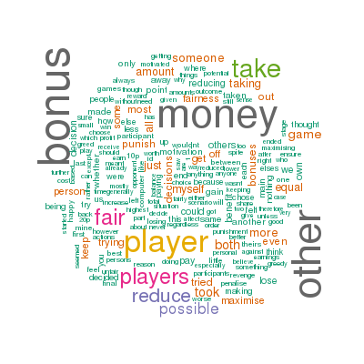

```{r setup, include=FALSE}
library(targets)
library(tidyverse)
library(knitr)
opts_chunk$set(echo = FALSE)
```

This document outlines the initial data exploration and analyses for Study 1 of our project "Mapping out the punishment strategy space".

# Sample

After cleaning the data, we have data for `r nrow(tar_read(d1))` participants from Prolific. This sample is representative of the United Kingdom.

```{r sample, out.width="65%", fig.align='center'}
tar_read(plotSample)
```

# Punishment games

We asked participants to respond to six games where they had the opportunity to punish another player for their behaviour. We refer to these games as follows:

- No Disadvantageous Inequity 1
- No Disadvantageous Inequity 2
- No Disadvantageous Inequity 3 (Computer)
- No Disadvantageous Inequity 4 (1:1 Fee Fine Ratio)
- Disadvantageous Inequity
- Third-Party

In each game, participants could punish (1) when the other player chose to "take" and (2) when the other player did nothing. For more details about these games (e.g. exact payoff structures), see preregistration.

## Comprehension

Answers to the comprehension questions revealed that participants were able to understand the payoff structure of all six punishment games.

```{r comp}
kable(tar_read(tableComp), booktabs = TRUE)
```

## Punishment decisions

We can plot the proportion of participants who decided to punish in each game.

```{r decisions, out.width="75%", fig.align='center'}
tar_read(plotDecisions)
```

Participants appear more likely to punish if the other player took, compared to when they did nothing. Participants were most likely to punish when the other player took in the disadvantageous inequity game and in the third-party game.

## Reasons given for punishing in the games

At the end of the survey, we asked participants why they decided to punish (if they ever did). First, we allowed them to provide an open-ended answer to this question. The following wordcloud summarises frequently used words in these open-ended answers.

```{r wordcloud, echo=FALSE, out.width="50%", fig.align='center'}

```

Second, we gave participants a number of sliders on which they could rate how strongly they followed different approaches to the games. Below are the raw distributions from these slider scales (0 = statement does not apply, 1000 = statement does apply).

```{r sliders1, fig.height=3, warning=FALSE, error=FALSE}
tar_read(plotSliders1)
```

We can also visualise these distributions as deviations from participant's average ratings across all sliders.

```{r sliders2, fig.height=3, warning=FALSE, error=FALSE}
tar_read(plotSliders2)
```

Participants reported being especially motivated by equality, avoiding disadvantageous inequity, and seeking advantageous inequity. People also expressed that they never punished.

# Frequencies of punishment strategies

Before data collection, we posited ten different strategies that might underlie people's punishment behaviour in the games:

- Competitive
- Avoid disadvantageous inequity
- Egalitarian
- Seek advantageous inequity
- Retributive
- Deterrent
- Norm-enforcing
- Antisocial
- Random choice
- Anti-punish

We pre-registered predictions for how these strategies would behave in the different games. 

## Counts from raw data

As a first step, we can look to see how many participants fitted these strategy predictions _exactly_ across all games, by simply counting the raw data.

```{r strategyCounts}
kable(tar_read(tableStrategyCounts), booktabs = TRUE)
```

Many participants, denoted by N/A, were unable to be classified into a strategy (i.e. their pattern of behaviour across all games did not fit any of our strategy predictions). However, of the participants who could be classified, most followed the "anti-punish" strategy by never punishing. The next most common strategies were the "egalitarian" and "avoid disadvantageous inequity" strategies.

We can also look at the most common behavioural patterns across all six games (twelve punishment decisions in total). Below, we summarise the five most common patterns of behaviour as strings of twelve 0s and 1s, indicating whether participants did (1) or did not (0) punish in each game, with a brief explanation of this pattern and its frequency in the dataset.

```{r patterns}
kable(tar_read(tablePatterns), booktabs = TRUE)
```

## Bayesian modelling

We can also estimate the frequencies of different strategies using a Bayesian approach. We construct a model that contains our _apriori_ predictions for the different punishment strategies, and the feed the model our raw data to estimate the relative probabilities of following each strategy. In the model, we assume that participants sometimes make errors in converting their strategy into behaviour (5% error rate), which could explain why many of the participants were unable to be classified into a strategy type in our raw counts above. The Bayesian model is fitted in the probabilistic programming language Stan.

```{r post probs}
P <- tar_read(post1)$alpha
for (i in 1:nrow(P)) P[i,] <- rethinking::softmax(P[i,])
anti <- P[,10]
```

In line with our raw counts, the model predicts that participants follow the "anti-punish" strategy with a probability of `r round(median(anti), 2)`, 95% credible interval [`r round(quantile(anti, 0.025), 2)` `r round(quantile(anti, 0.975), 2)`]. We plot the posterior probabilities for the remaining punishment strategies below.

```{r model1, message=FALSE, out.width="80%", fig.align='center'}
tar_read(plot1)
```

Taking advantage of all available data, the model suggests that "egalitarian" is the most common punishment strategy. All other strategies have median posterior probabilities less than 10%. In order of decreasing probability, the next most common punishment strategies are "norm-enforcing", "seek advantageous inequity", "deterrent", and "avoid disadvantageous inequity", although all are similarly likely. "Competitive" and "antisocial" punishment strategies are the most unlikely.

# Predicting strategy usage

We then fit a series of models predicting the usage of different strategies from a variety of predictors. In each plot that follows, we show the posterior predictions from a model that includes a single variable as a predictor of all ten strategies simultaneously. The plots show the median regression lines with shaded 95% credible intervals. The model-estimated slopes for each strategy are included in each panel.

```{r plot2, fig.width=7, fig.height=4, fig.align='center', out.width="100%"}
tar_read(plot2_Age)
tar_read(plot2_SelfRate_1)
tar_read(plot2_SelfRate_2)
tar_read(plot2_SelfRate_3)
tar_read(plot2_SelfRate_4)
tar_read(plot2_SelfRate_5)
tar_read(plot2_SelfRate_6)
tar_read(plot2_SelfRate_7)
tar_read(plot2_SelfRate_8)
tar_read(plot2_SelfRate_9)
tar_read(plot2_SelfRate_10)
tar_read(plot2_SelfRate_11)
```
